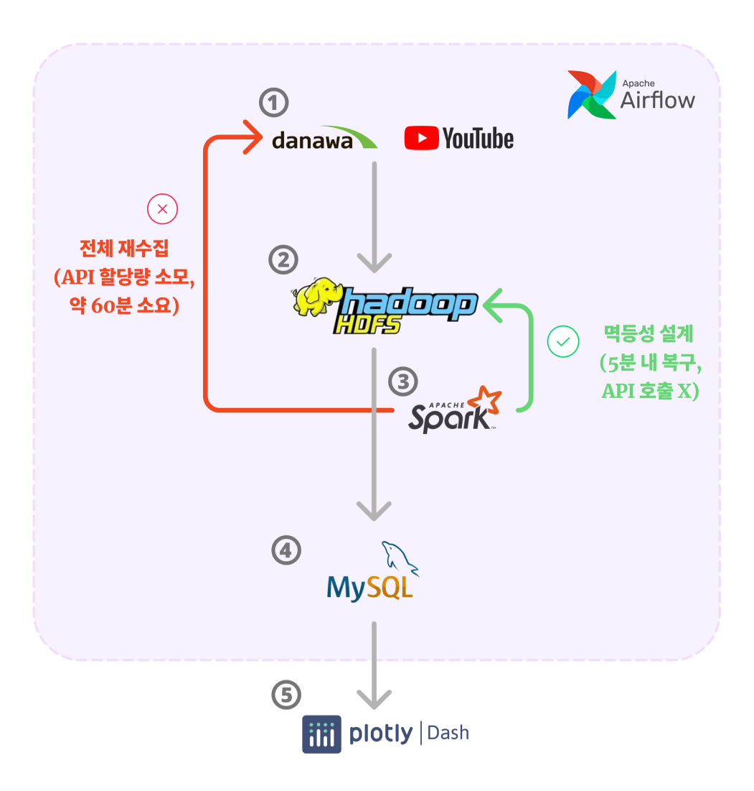
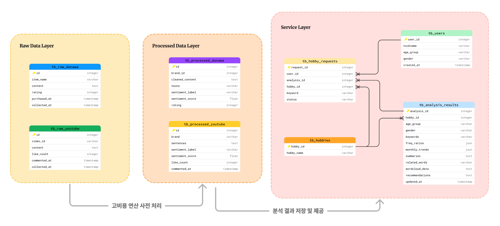

# 📱 리뷰 데이터 기반 스마트폰 추천 파이프라인 구축 (PHOBBY)

유튜브 및 다나와 리뷰 데이터를 수집하여 사용자 맞춤형 스마트폰 분석 리포트를 제공하는 엔드투엔드 파이프라인 구축 프로젝트입니다.

## 프로젝트 개요
- 진행 기간 : 2025.01 ~ 2025.03 (3개월)
- 팀 구성 : 4인 협업 프로젝트 (데이터 엔지니어링 파트 담당)

## 기술 스택

- Ingestion : Selenium, YouTube API
- Orchestration : Airflow
- Processing : PySpark, Pandas
- Storage : HDFS, MySQL
- Serving : Plotly Dash

## 데이터 파이프라인 아키텍처
- 장애 발생 시 API 할당량 소모 없이 **5분 내 복구가 가능한 멱등성(Idempotency) 설계**를 최우선으로 구축

## 데이터 모델링

- 정규화 : 취미 명칭(tb_hobbies) 등을 독립 테이블로 분리하여 데이터 중복을 방지하여 데이터 무결성 확보 
- 반정규화 : 결과 테이블(tb_analysis_results)에 자주 사용되는 필터 조건([나이+성별+키워드])을 직접 포함시켜 Join 연산 제거 
- 인덱스 설계 : 복합 인덱스 적용으로 실시간 대시보드 쿼리 시 Full Table Scan 방지 및 응답 시간 단축
- 비용 최적화 : 기존 분석 결과 재활용으로 LLM 호출 최소화 

## 문제 해결 및 개선 요약

### 1) 멱등성 확보 및 장애 복구 시간 90% 단축

**문제**
- 외부 API 수집 중 장애 발생 시, 전체 재수집으로 인한 API 할당량 낭비 및 약 60분의 지연 시간 발생

**해결**
- **HDFS 스테이징 레이어**를 도입하여 원본 데이터를 Parquet 포맷으로 보존
- 장애 시 소스로부터 재수집하는 대신 HDFS 데이터를 활용해 즉시 재처리하고, **Overwrite 전략**으로 데이터 중복을 방지하는 멱등성 확보

**결과**
- 장애 발생 시 복구 시간을 **60분에서 5분 이내로 약 90% 이상 단축**
- 불필요한 외부 API 호출을 방지하여 **수집 비용 최적화**

### 2) LLM 호출 최적화 및 운영 비용 효율화

**문제**
- 모든 사용자 요청마다 LLM을 호출하여 분석 리포트를 생성하므로 API 비용이 과다 발생하고 응답 속도가 저하됨
  
**해결**
- 동일한 [나잇대 + 성별 + 취미 + 키워드] 조합의 요청은 **기존 분석 결과를 재사용하도록 설계**
- 분석 결과 데이터 모델링을 통해 불필요한 AI 재호출을 방지하여 리소스 효율 극대화

**결과**
- 불필요한 중복 AI 호출을 원천 차단하여 **리소스 소모 및 비용 효율 극대화**
- 이미 분석된 조합의 경우 LLM 연산 대기 시간 없이 즉시 서빙하여 **응답 성능 개선**

### 3) 계층형 Airflow DAG 설계 및 데이터 최신성 확보 

**문제**
- 소스별(YouTube, 다나와)로 상이한 전처리 로직을 개별 관리해야 하며, 신규 기종 출시 시점에 실시간으로 쏟아지는 리뷰 데이터를 월 단위 갱신으로는 적시에 수집하지 못함

**해결**
- Airflow를 사용하여 소스별 독립적인 전처리/적재 DAG를 구축하고, 이를 Main DAG에서 통합 트리거하는 구조로 설계하여 운영 효율성을 높임
- **수집 주기를 1시간 단위로 단축**하여 신상 폰 출시 등 시장 상황에 맞춘 실시간 데이터 자동화 환경을 구현함

**결과**
- 신규 스마트폰 리뷰의 즉각적 반영을 통한 **데이터 최신성 확보**
- 파이프라인 관리 포인트 단일화로 운영 생산성 향상

### 4) 가공 테이블 설계를 통한 서빙 성능 개선 

**문제**
- 웹 서비스에서 원본 데이터를 호출 시 실시간 전처리(문장 분리, 감성 분석 등) 로직으로 인해 약 374초의 응답 지연이 발생하여 정상적인 서비스 이용이 어려움

**해결**
- **MySQL 가공 테이블**을 구축하여 무거운 분석 로직을 사전에 배치 처리 및 적재
- Celery/Redis 기반의 **비동기 처리 구조**를 도입하여 사용자 대기 시간을 5초 이내로 약 90% 이상 단축함

**결과**
- 첫 페이지 로딩 및 분석 리포트 생성 시간을 **374초에서 5초 이내로 단축 (약 90% 이상 개선)**
- 사용자 대기 시간을 획기적으로 줄여 실제 서비스가 가능한 수준의 사용자 경험(UX) 확보

