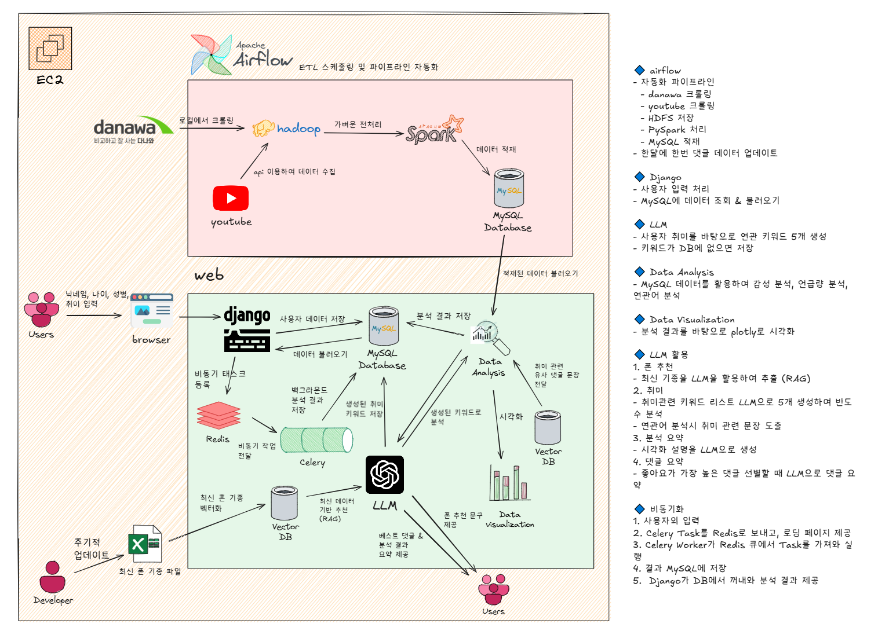

# 프로젝트 개요

## 🔧 서비스 기능

- 📊 스마트폰 리뷰 크롤링 (다나와, 유튜브 api)
- 🔄 ETL 자동화 파이프라인 구축 (Apache Airflow 기반)
- 📂 대용량 데이터 저장 및 분산처리 (HDFS + Spark 활용)
- 🧼 데이터 전처리 및 감성 분석 (Spark, Pandas)
- 🧠 LLM 기반 RAG 추천 시스템 (Chroma + OpenAI)
- 💡 Django 기반 사용자 맞춤형 추천 결과 제공
- 📈 분석 시각화 (django-plotly-dash)

## 🖼 프로젝트 아키텍처


## 🗂 프로젝트 파일 구조

```bash
PhoneRecommender/
├── airflow/                       # Airflow DAG 및 자동화 스크립트
│   ├── dags/                      # ETL 워크플로우 정의
│   ├── danawa_data/               # 다나와 수집 데이터
│   └── youtube_data/              # 유튜브 수집 데이터
│
├── web_project/                   # Django 기반 웹 서비스
│   ├── analysis/                  # 분석 기능 앱
│   ├── config/                    # Django 설정
│   ├── crawled_data/              # 크롤링 데이터
│   ├── data/                      # RAG용 최신 폰 기종 데이터
│   ├── dash_apps/                 # Dash 기반 시각화 앱
│   ├── hobbies/                   # 사용자 취향 관련 앱
│   ├── users/                     # 사용자 관리 앱
│   ├── utils/                     # 함수 및 유틸 모음
│   ├── templates/                 # HTML 템플릿
│   ├── static/                    # CSS, JS 등 정적 파일
│   ├── manage.py                  # Django 실행 스크립트
│   └── requirements.txt           # 백엔드 의존 패키지 목록
│
├── notebooks/                     # Jupyter 분석 노트북 및 코드
│   ├── db_setup/                  # DB 초기화 및 테이블 설정
│   ├── data_pipeline/             # HDFS → Spark → MySQL ETL 파이프라인
│   ├── data_analysis/             # 리뷰 및 유튜브 데이터 분석
│   ├── llm_workflow/              # 키워드 추출, LLM 결과 저장 등
│   └── datasets/                  # CSV, 엑셀 등 학습/분석용 데이터
│
├── images/                        # 아키텍처 및 시연 스크린샷
│   └── architecture.png
│   └── web_screenshots
├── .gitignore                     # 업로드 제외 파일 목록
└── README.md                      # 프로젝트 개요 및 설명

```
