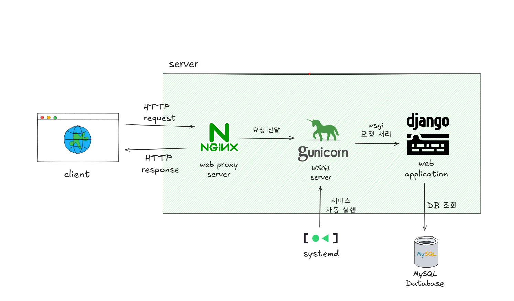
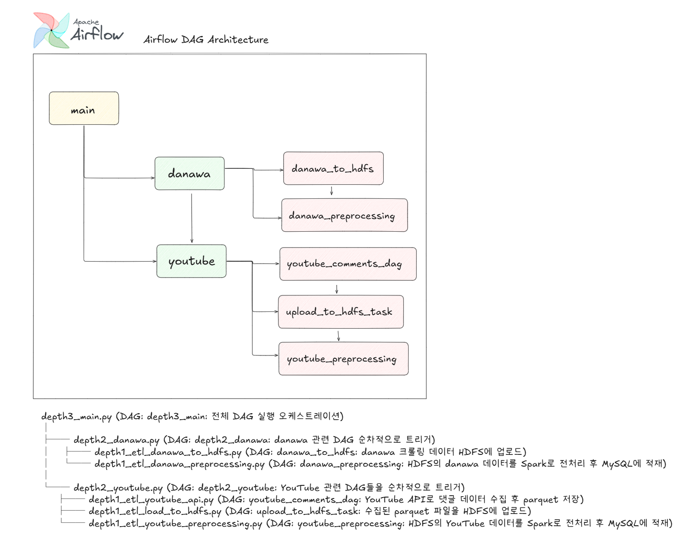
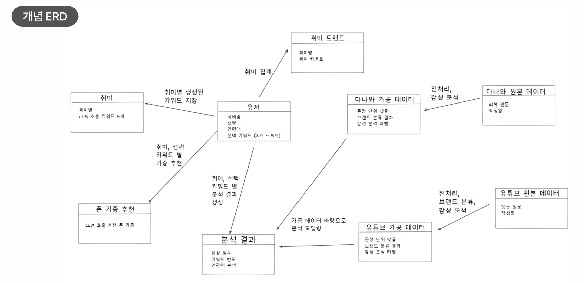
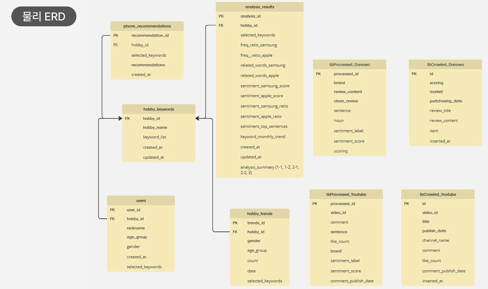

# 📱 스마트폰 리뷰 기반 맞춤형 추천 시스템 프로젝트

사용자 리뷰 및 영상 데이터를 활용해 취향 기반 스마트폰을 추천하는 웹 서비스를 개발한 프로젝트입니다.


AWS EC2 환경에서 HDFS와 MySQL을 연동하고, Apache Airflow를 통해 데이터 수집부터 정제, 적재까지의 ETL 파이프라인을 직접 구성해보며, 데이터 엔지니어링 전반의 흐름을 경험할 수 있었습니다.

## 프로젝트 개요
- 진행 기간 : 2025.01.23 ~ 2025.03.28


### 팀 구성 및 역할
| 이름           | 역할                 | 주요 기여                                                                                                                                                                                                                              |
| ------------ | ------------------ | ---------------------------------------------------------------------------------------------------------------------------------------------------------------------------------------------------------------------------------- |
| **신지수 (본인)** | 데이터 엔지니어링 / 백엔드 개발  | - 전체 데이터 파이프라인 구성 및 자동화 운영<br>- Airflow 기반 워크플로우 설계 및 통합<br>- Pandas 기반 감성 분석 및 키워드 추출<br>- Spark를 통한 HDFS → MySQL 정제 처리<br>- OpenAI + Chroma 기반 LLM 추천 시스템(RAG 구조) 개발<br>- Django 기반 웹 서비스 개발 및 배포<br>- MySQL 기반 데이터 모델링 및 ERD 설계 |
| 최영준          | 데이터 수집 자동화 협업 (탈퇴) | - 다나와 리뷰 수집 스크립트 개발<br>- Airflow DAG로 다나와 수집 자동화 설정<br>- Airflow 구조 통합 일부 진행 후 중도 탈퇴                                                                                                                                               |
| 김현지          | 팀장 / 기획 / 발표       | - 프로젝트 기획 및 방향 설정<br>- UI 기획 및 와이어프레임 제작<br>- 발표 자료 작성 및 전체 발표 진행                                                                                                                                                                  |
| 박시현          | UI 디자인 보조          | - HTML 템플릿용 와이어프레임 및 디자인 시안 제작 보조             |

### 프로젝트 목표
- 데이터를 수집하여 분석과 추천에 활용 가능한 형태로 정제·가공하는 데이터 파이프라인 구축

- LLM 기반 자연어 추천 및 요약 자동화 구현

- 분석 결과를 시각화하고 사용자에게 제공하는 웹 인터페이스 개발

## 기술 스택

| 목적          | 사용 기술                                    |
| ----------- | ------------------------------------- |
| 데이터 수집      | Selenium, YouTube API                 |
| 워크플로우 자동화   | Apache Airflow                        |
| 데이터 처리 및 분석 | PySpark, Pandas, Jupyter Notebook         |
| 저장소         | HDFS, MySQL                           |
| AI 추천       | OpenAI API, Chroma Vector DB (RAG) |
| 웹 서비스       | Django, Plotly Dash                   |
| 비동기 처리      | Celery, Redis                         |
| 클라우드 환경        | AWS (EC2)                |
| 배포          | Gunicorn, Nginx, systemd            |

## 시스템 아키텍처



## 주요 기능
| 기능        | 설명                            |
| --------- | ----------------------------- |
| 리뷰 데이터 수집 | 다나와 리뷰 크롤링, 유튜브 댓글 수집         |
| 자동화 파이프라인 | 수집~~정제~~저장 전 과정을 Airflow로 자동화 |
| 감성 분석     | Hugging Face 모델 기반 긍/부정 분류    |
| 키워드 분석    | RAG 구조로 리뷰 내 키워드 추출 및 빈도 분석   |
| 추천 생성     | LLM 기반 자연어 문장 생성 및 사용자 맞춤 추천  |
| 시각화       | 감성 점수, 키워드 트렌드를 대시보드로 제공      |
| 비동기 처리    | Celery + Redis 기반 분석 응답 병렬 처리 |


## 데이터 파이프라인 구조 (Airflow)
- 수집 데이터 흐름: YouTube API로 댓글 수집 → HDFS 업로드 → Spark 전처리 후 MySQL 적재
- Airflow DAG orchestration: `main` DAG에서 전체 흐름 조정
- 실행 주기: 매월 1일 자동 실행
- 운영 안정성 확보: 이메일 알림 및 에러 로그 추적 설정 (SMTP 설정)



## 데이터 모델링
- 사용자의 취미 선택 → 키워드 생성 → 분석 → 추천

- 개념 ERD


- 물리 ERD
- 

## 문제 해결 경험
1. Airflow 병합 작업
- 팀원이 작성한 DAG와 병합하여 하나의 ETL 흐름으로 통합하는 과정에서 변수명 불일치, 의존성 설계 방식 차이 문제가 발생 → 작업 분기를 통합하여 병합 완료
- 
2. 비동기 처리 구조 설계
- 분석 시간이 길어지면서, 웹 응답 대기 시간이 사용자 경험을 저해
- Celery + Redis 기반 비동기 큐를 도입해 요청과 처리를 분리

## 프로젝트 파일 구조

```bash
PhoneRecommender/
├── airflow/                       # ETL 자동화
│   ├── dags/                      # Airflow DAG
│   ├── danawa_data/               # 다나와 수집 데이터
│   └── youtube_data/              # 유튜브 수집 데이터
│
├── web_project/                   # Django 기반 웹 서비스
│   ├── analysis/                  # 분석 기능 앱
│   ├── config/                    # Django 설정
│   ├── crawled_data/              # 크롤링 데이터
│   ├── data/                      # RAG용 최신 폰 기종 데이터
│   ├── dash_apps/                 # Dash 기반 시각화 앱
│   ├── hobbies/                   # 사용자 취향 관련 앱
│   ├── users/                     # 사용자 관리 앱
│   ├── utils/                     # 함수 및 유틸 모음
│   ├── templates/                 # HTML 템플릿
│   ├── static/                    # CSS, JS
│   ├── manage.py                  # Django 실행 스크립트
│   └── requirements.txt          
│
├── notebooks/                     # Jupyter 분석 노트북 및 코드
│   ├── db_setup/                  # DB 초기화 및 테이블 설정
│   ├── data_pipeline/             # HDFS → Spark → MySQL ETL 파이프라인
│   ├── data_analysis/             # 리뷰 및 유튜브 데이터 분석
│   ├── llm_workflow/              # 키워드 추출, LLM 결과 저장 등
│   └── datasets/                  # CSV, 엑셀 등 학습/분석용 데이터
│
├── images/                        # 아키텍처 및 시연 스크린샷
│   └── architecture.png
│   └── web_screenshots
├── .gitignore                    
└── README.md                     

```
